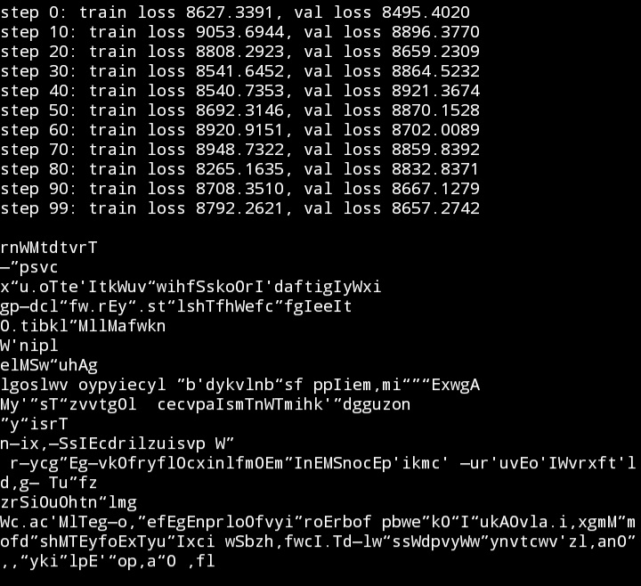

This code is influenced by Andrej Karpathy's lecture videos and the following code repositories.

A numpy implementation of NanoGPT without backprop so far. I will add the backprop in the future.

Loss is random and the output doesn't make sense because there is no backprop.

#### ORIGINAL CODE
https://github.com/karpathy/ng-video-lecture

#### EDITED VERSION
https://github.com/karpathy/nanoGPT
